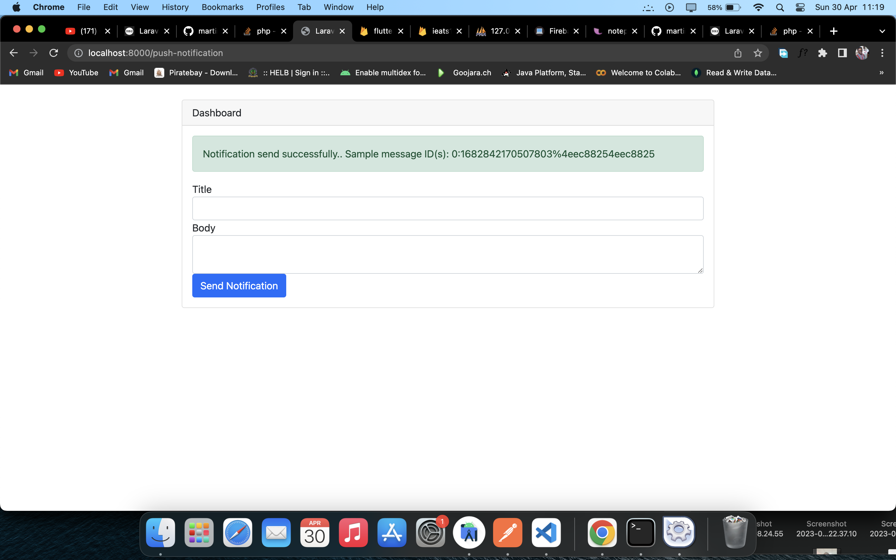

# laravel_fcm_and_notifications
- Links: [FCM push nitification tutorial](https://www.itsolutionstuff.com/post/laravel-firebase-push-notification-to-android-and-ios-app-exampleexample.html)
1. create project:
```
composer create-project --prefer-dist laravel/laravel laravel_fcm_and_notifications
or
laravel new laravel_fcm_and_notifications
```
2. Add colum device_token to users table:
```
php artisan make:migration "add device_token column to users table"
```
3. Edit database/migrations/2021_04_03_093425_add_device_token_column_to_users_table.php and replace with the following code instead

```
<?php

use Illuminate\Database\Migrations\Migration;
use Illuminate\Database\Schema\Blueprint;
use Illuminate\Support\Facades\Schema;

return new class extends Migration
{
    /**
     * Run the migrations.
     *
     * @return void
     */
    public function up()
    {
        Schema::table('users', function (Blueprint $table) {
            $table->after('remember_token',function($table){
                $table->text('device_token')->nullable();
            });
        });
    }

    /**
     * Reverse the migrations.
     *
     * @return void
     */
    public function down()
    {
        Schema::table('users', function (Blueprint $table) {
            $table->dropColumn('device_token');
        });
    }
};

```
- Add Manually a list of device tokens to the user's table.
- [Link to repository to obtain flutter device token ](https://github.com/martin-ngigi/flutter_fcm_notifications)
4. create NotificationController controller:
```
php artisan make:controller NotificationController
```
5. Edit the .env file add add server key i.e.
```
FCM_SERVER_KEY="xxxxxx"
```
6. Obtain server key from the same project that the device fcm token was obtained from. <br>
- 
- 